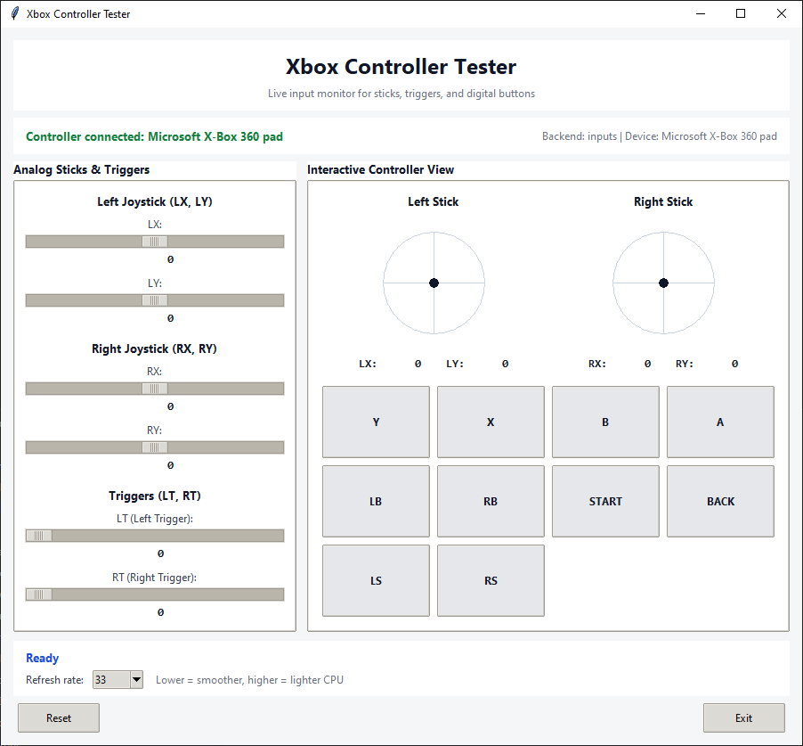
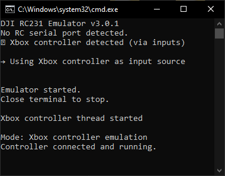

# DJI RC-N1 and Xbox Controller Simulator Emulator

This repository is a Windows-based controller bridge for flight simulators such as DCL - The Game.
It reads input from either a DJI RC-N1 remote controller or an Xbox-compatible controller, then exposes that input to Windows as a virtual Xbox 360 gamepad through `vgamepad`.

This project is based on the original work from IvanYaky:
https://github.com/IvanYaky/DJI_RC-N1_SIMULATOR_FLY_DCL

This fork adds:
- Xbox controller input support
- A GUI controller tester
- Broader controller axis/button mapping support
- Cleaner startup behavior and serial port handling

## Contents

- [Compatibility Summary](#compatibility-summary)
- [Overview](#overview)
- [Design Goals](#design-goals)
- [Why Detection Happens at Startup](#why-detection-happens-at-startup)
- [Installation](#installation)
- [Usage](#usage)
- [Controller Mapping](#controller-mapping)
- [GUI Controller Tester](#gui-controller-tester)
- [Runtime Behavior and Stability Notes](#runtime-behavior-and-stability-notes)
- [Troubleshooting](#troubleshooting)
- [Build](#build)
- [DCL Preset](#dcl-preset)

## Compatibility Summary

- 🎮 Connect your DJI remote controller or Xbox controller to your PC and use it with supported simulators through a virtual Xbox 360 gamepad.
- ✅ Confirmed on this fork: DJI Mavic 3 RC231 and Xbox 360 Controller for Windows.
- 🔀 Other DJI model projects:
  [justin97530/miniDjiController](https://github.com/justin97530/miniDjiController)
- 🔀 DJI Mini 2 reference project:
  [usatenko/DjiMini2RCasJoystick](https://github.com/usatenko/DjiMini2RCasJoystick)
- 🔀 DJI Phantom 3 reference project:
  [mishavoloshchuk/mDjiController](https://github.com/mishavoloshchuk/mDjiController)

## Overview

Supported input sources:
1. DJI RC-N1 / RC231 over USB serial
2. Xbox 360 / Xbox One / Xbox Series controllers through Windows gamepad APIs

Output target:
1. A virtual Xbox 360 controller presented to Windows

Typical use case:
1. Connect the physical controller to the PC
2. Run `main.py`
3. Let the simulator read the virtual Xbox 360 controller


## Design Goals

This fork is intentionally optimized for:
- Stable runtime behavior
- Predictable device selection
- Low overhead during control input processing

It is not optimized for dynamic hot-plug switching while the app is already running.
That design choice is deliberate.

## Why Detection Happens at Startup

The application detects the active input source during startup, selects one mode, and then keeps the runtime path fixed.
This is the most conservative design for this type of emulator.

Reasons:
- It avoids mode switching while the virtual gamepad is already driving a simulator.
- It removes most reconnect edge cases and state transitions.
- It keeps the runtime loop simple and low overhead.
- It reduces the chance of stuck input, duplicated input paths, or race conditions between detection and control threads.

Practical consequence:
- For best results, connect the Xbox controller or RC-N1 before launching `main.py`.
- If the controller is plugged in after the main application has already started, the app will not switch into that device automatically.

This is a stability tradeoff, not a missing feature by accident.

## Installation

### Requirements

- Windows
- Python 3.9 or newer

### Python dependencies

Install the required packages:

```bash
pip install -r requirements.txt
```

Or install manually:

```bash
pip install vgamepad pyserial inputs pygame
```

Notes:
- `inputs` is the preferred Xbox input backend when available.
- `pygame` is used as a fallback backend for broader compatibility.
- `vgamepad` requires the Windows virtual gamepad driver it depends on.

### RC-N1 driver requirement

If you plan to use the DJI RC-N1:
1. Install [DJI Assistant 2](https://www.dji.com/downloads/softwares/dji-assistant-2-consumer-drones-series)
2. Close the application after installation
3. Keep the driver installed on the system

## Usage

### Recommended operating sequence

For the most stable behavior:
1. Connect the controller first
2. Confirm Windows can see the device
3. Run the tester if needed
4. Start `main.py`

This applies to both RC-N1 and Xbox controller mode.

### Start in auto mode

Default mode is `auto`.
The app checks for an RC serial device first, then falls back to Xbox if available.

```bash
python main.py
```

Equivalent:

```bash
python main.py -m auto
```

### Start in RC-N1 mode

Use this when you only want the DJI RC-N1 path.

```bash
python main.py -m rc
```

If you know the serial port, you can specify it directly:

```bash
python main.py -m rc -p COM9
```

Behavior:
- If `-p` is provided, the app tries that port directly.
- If `-p` is omitted, the app scans for a DJI protocol port automatically.

### Start in Xbox mode

Use this when you only want Xbox controller input.

```bash
python main.py -m xbox
```

Behavior:
- The app detects the Xbox input backend during startup.
- The selected runtime path stays fixed after startup.

### Batch files

- `start.bat`: start the main application with the local virtual environment if present
- `test_controller.bat`: open the GUI controller tester
- `build.bat`: build Windows executables with PyInstaller

## Controller Mapping

### RC-N1 mode

The app reads RC channel data from the DJI serial protocol and maps it to:
- Left virtual stick
- Right virtual stick
- Camera wheel / auxiliary action

### Xbox mode

The app maps:
- Left stick to the left virtual stick
- Right stick to the right virtual stick
- Right trigger to positive auxiliary action
- Left trigger to negative auxiliary action

The trigger path is used to drive the same virtual actions that RC mode uses for the camera wheel behavior.

## GUI Controller Tester

The GUI tester is intended for verification before starting the main emulator.

Run:

```bash
python test_controller_gui.py
```

Or:

```bash
test_controller.bat
```

What it is for:
- Verify that Windows sees the controller
- Confirm stick axes move in the expected direction
- Confirm trigger values return to zero correctly
- Confirm buttons are reported correctly
- Check whether `inputs` or `pygame` is being used

Why this matters:
- If the tester cannot see correct values, the main emulator will not behave correctly either.
- Testing here first is safer than debugging inside the simulator.



## Runtime Behavior and Stability Notes

The main application prioritizes deterministic runtime behavior over hot-plug convenience.

That means:
- Input source detection is performed at startup
- The mode is fixed after selection
- No continuous device re-scan runs in the main control loop

Advantages:
- Lower runtime complexity
- Lower risk of reconnect-related bugs
- More predictable control behavior during simulator use
- Minimal additional polling overhead

Tradeoff:
- If you plug in the controller after the main app has already started, you may need to restart the app

For this project, that tradeoff is intentional because it is the safer default for a control bridge.

## Troubleshooting

### Xbox controller is not detected

Check the following:
1. Connect the controller before launching `main.py`
2. Confirm it appears in Windows Game Controllers
3. Run `test_controller_gui.py`
4. Install both backends:

```bash
pip install inputs pygame
```

If the tester works but `main.py` does not:
- Make sure you are launching the same Python environment
- Make sure the controller is already connected before startup

### Controller opens in tester but not in the game

Check the following:
1. Confirm the game is configured for Xbox controller input
2. Confirm the virtual controller from `vgamepad` is available
3. Verify axis and trigger behavior in the tester first

### RC-N1 is not detected

Check the following:
1. Use the bottom USB-C port on the controller
2. Reinstall the DJI Assistant 2 driver
3. Try another USB port or cable
4. Check Device Manager for the DJI serial device

The app now keeps serial startup output concise:
- It reports only relevant RC candidates
- It does not print every unrelated Bluetooth COM port during scanning

Example image:



### RC-N1 serial errors

If automatic scan fails, try a fixed port:

```bash
python main.py -m rc -p COM9
```

If the port still fails:
- another application may be holding the serial port
- the DJI driver may not be installed correctly
- the detected COM port may not be the DJI protocol port

## Build

To build standalone Windows executables:

```bash
build.bat
```

This generates:
- `dist\DJI-RC-N1-Simulator.exe`
- `dist\Xbox-Controller-Tester.exe`

## DCL Preset

Tested with DCL - The Game:
https://store.steampowered.com/app/964570/DCL__The_Game/

Recommended preset:
- Mode 2
- Acro
- Zero throttle at stick center


